# MobileUNETR
## A Lightweight End-To-End Hybrid Vision Transformer For Efficient Medical Image Segmentation: [ECCV 2024 -- BioImage Computing] (ORAL) https://arxiv.org/abs/2409.03062

## Architecture
<p align="center">
  <div style="position: relative; display: inline-block;">
    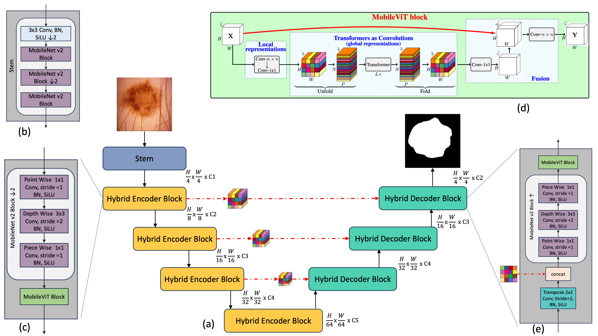
  </div>
</p>

## Parameter Distribution and Computational Complexity
<p align="center">
  <div style="position: relative; display: inline-block;">
    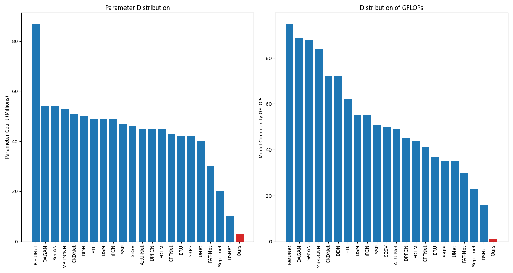
  </div>
</p>

## :rocket: News
* Repository Construction Complete 06/09/2024
* We will continue to update the GitHub repository with new experiments with a wide range of datasets, so be sure to check back regularly.
* In the meantime -> Checkout our other projects: https://github.com/OSUPCVLab/SegFormer3D

## Overview:
    * Segmentation approaches broadly fall into 2 categories. 
        1. End to End CNN Based Segmentation Methods
        2. Transformer Based Encoder with a CNN Based Decoder. 
    * Many Transformer based segmentation approaches rely primarily on CNN based decoders overlooking the benefits of the Transformer architecture within the decoder. 
    * We address the need for an efficient/lightweight segmentation architecture by introducing MobileUNETR, which aims to overcome the performance constraints associated with both CNNs and Transformers while minimizing model size, presenting a promising stride towards efficient image segmentation. 
    * MobileUNETR has 3 main features. 
      1.  MobileUNETR comprises of a lightweight hybrid CNN-Transformer encoder to help balance local and global contextual feature extraction in an efficient manner.
      2.  A novel hybrid decoder that simultaneously utilizes low-level and global features at different resolutions within the decoding stage for accurate mask generation.
      3. surpassing large and complex architectures, MobileUNETR achieves superior performance with 3 million parameters and a computational complexity of 1.3 GFLOPs.

## Stand Alone Model [Please Read]
To help improve ease of use of the MobileUNETR architecture, the model is constructed as a single stand alone file. If you want to use the model outside of the provided code base simply grab the mobileunetr.py file from architectures folder and insert it into your own project. 

* Example:
```
# import from mobileunetr.py file
from mobileunetr import build_mobileunetr_s, build_mobileunetr_xs, build_mobileunetr_xxs
import torch

# create model
mobileunetr_s = build_mobileunetr_s(num_classes= 1, image_size=512)

mobileunetr_xs = build_mobileunetr_xs(num_classes=1, image_size=512)

mobileunetr_xxs = build_mobileunetr_xxs(num_classes=1, image_size= 512)

# forward pass
data = torch.randn((4, 3, 512, 512))
out = mobileunetr_xxs.forward(data)
print(f"input tensor: {data.shape}")
print(f"output tensor: {out.shape}")

```

## Data and Data Processing
* ISIC Data -- https://challenge.isic-archive.com/data/
* PH2 Data -- https://www.fc.up.pt/addi/ph2%20database.html

* Data Preprocessing
* For each dataset ISIC 2016, ISIC 2017 ... etc, Simply create a csv file with N rows 2 columns. Where N is the number of items in the dataset and 2 columns ["image", "mask"] are paths to input image and the path to target mask. 
* Once you have a train.csv and a test.csv (lets assume for ISIC 2016), inside experiments/isic_2016/exp_2_dice_b8_a2/config.yaml update the data path for the train and test csv files. And Follow the steps below to run the experiment.

## Run Your Experiment
In order to run an experiment, we provide a template folder placed under `MobileUNETR_HOME_PATH/experiments/isic_2016/experiment_folder` that you can use to setup your experiment. While inside the "experiment_folder" run your experiment on a single GPU with:
```shell
cd MobileUNETR
cd experiments/isic_2016/exp_2_dice_b8_a2/
# the default gpu device is set to cuda:0 (you can change it)
CUDA_VISIBLE_DEVICES="0" accelerate launch run_experiment.py
```
You might want to change the hyperparameters (batch size, learning rate, weight decay etc.) of your experiment. For that you need to edit the `config.yaml` file inside your experiment folder. 

As the experiment is running, the logs (train loss, vlaidation loss and dice score) will be written to the terminal. You can log your experiment on [wandb](https://wandb.ai/site) 
(you need to setup an account there) if you set `mode: "online"` in the `wandb_parameters` section of the `config.yaml`. The default value is `mode: "offline"`. If you want to log the result to your wandb account, put your wandb info into the `wandb_parameters` section of the `config.yaml` and your entire experiment will be logged under your wandb entity (e.g. `pcvlab`) page.

## ISIC 2016 Performance
<p align="center">
  <div style="position: relative; display: inline-block;">
    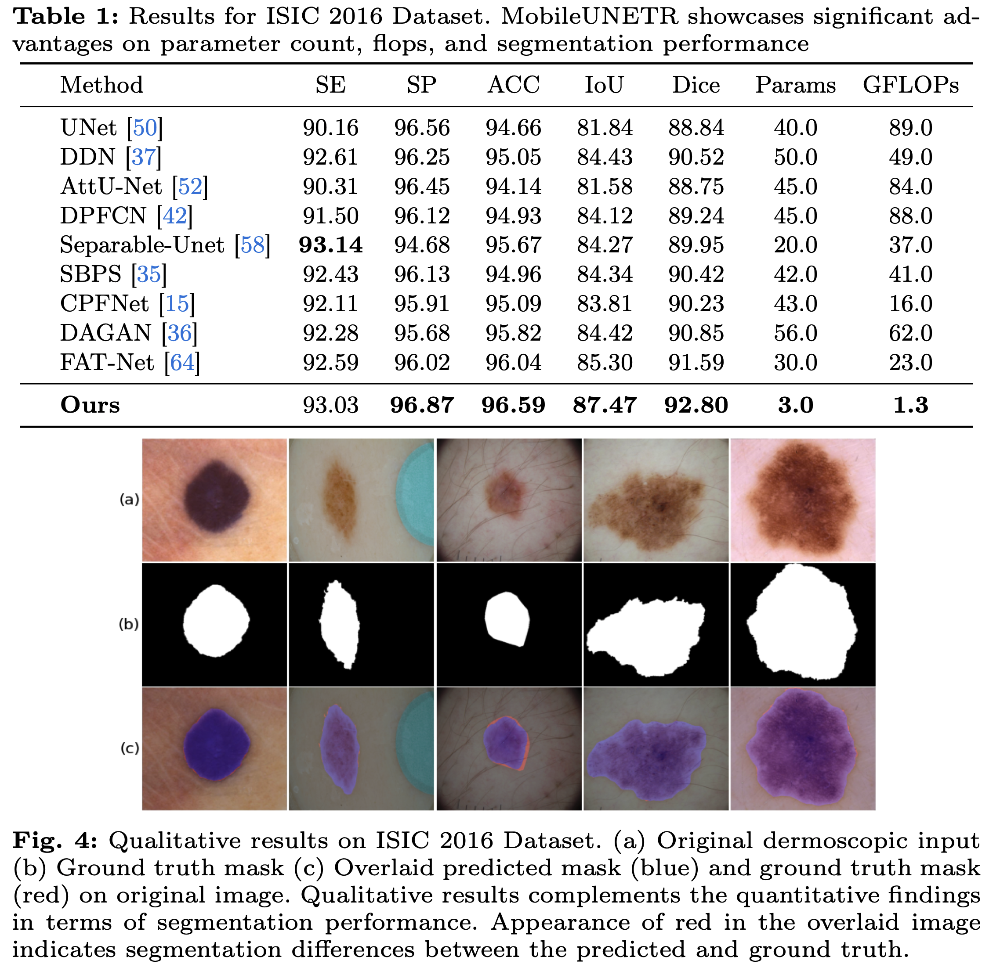
  </div>
</p>

## ISIC 2017 Performance
<p align="center">
  <div style="position: relative; display: inline-block;">
    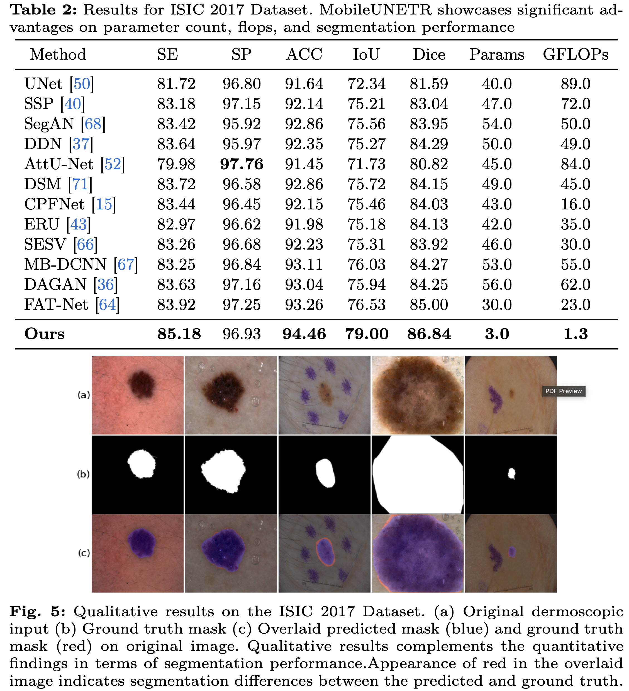
  </div>
</p>

## ISIC 2018 Performance
<p align="center">
  <div style="position: relative; display: inline-block;">
    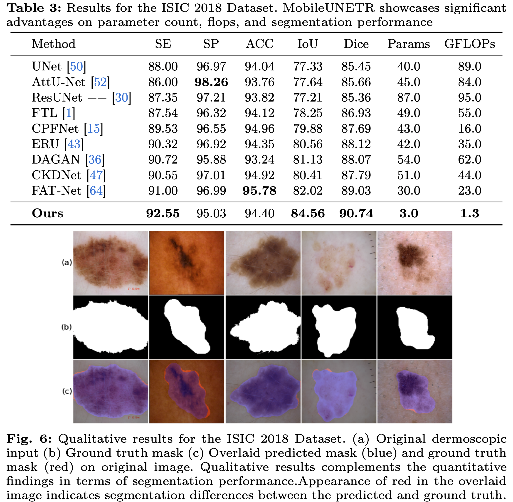
  </div>
</p>

## ISIC PH2 Performance
<p align="center">
  <div style="position: relative; display: inline-block;">
    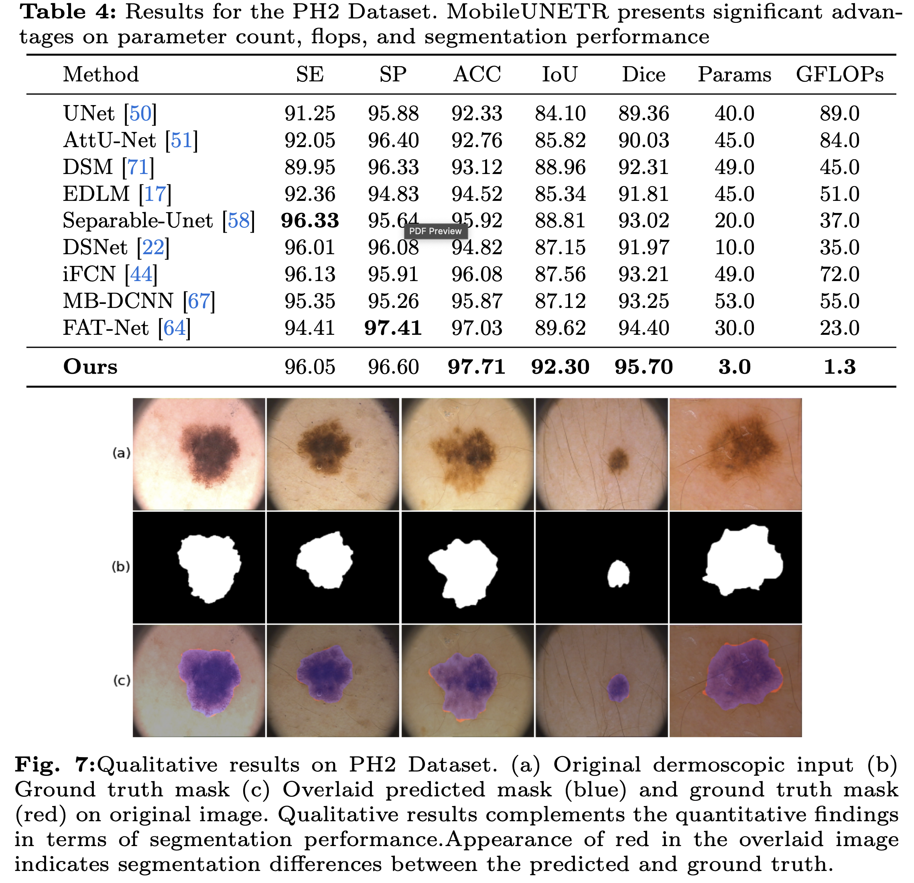
  </div>
</p>

## Advanced Architectures and Training Methods
<p align="center">
  <div style="position: relative; display: inline-block;">
    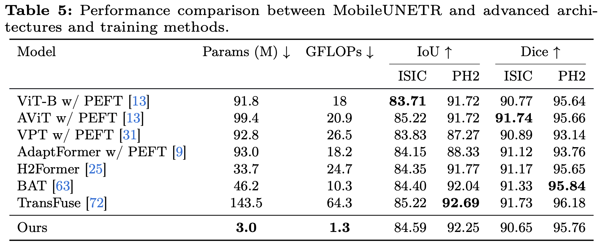
  </div>
</p>

## Experiments: Extending to Complex Real World Scenes (Cityscapes, Potsdamn and Vaihigen)

### Cityscapes Results

<p align="center">
  <div style="position: relative; display: inline-block;">
    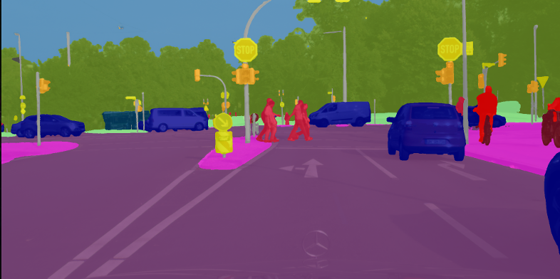
  </div>
</p>

<p align="center">
  <div style="position: relative; display: inline-block;">
    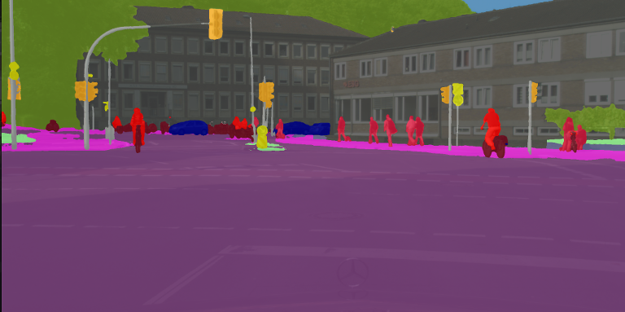
  </div>
</p>

<p align="center">
  <div style="position: relative; display: inline-block;">
    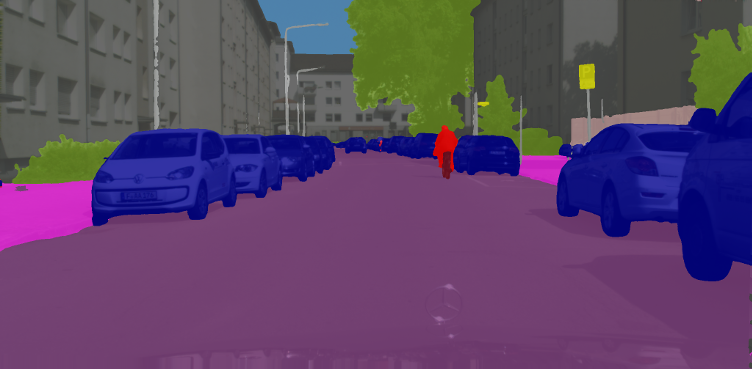
  </div>
</p>

<p align="center">
  <div style="position: relative; display: inline-block;">
    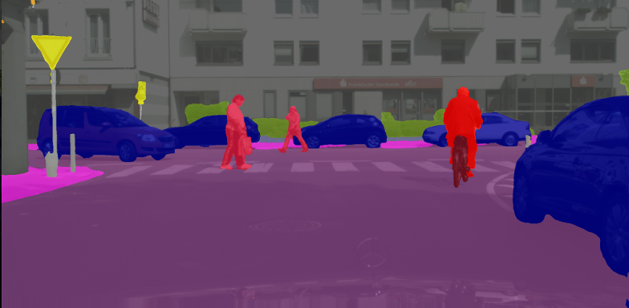
  </div>
</p>

<p align="center">
  <div style="position: relative; display: inline-block;">
    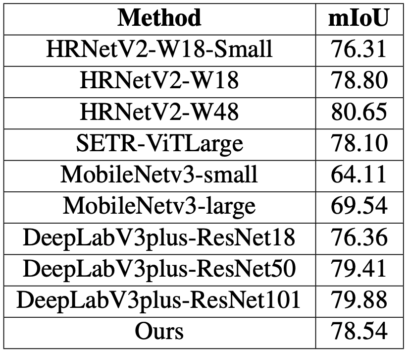
  </div>
</p>

### Potsdam and Vaihigen Results (GT [Left], Prediction Overlay [Right])

<p align="center">
  <div style="display: inline-block;">
    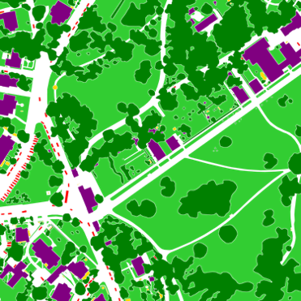
    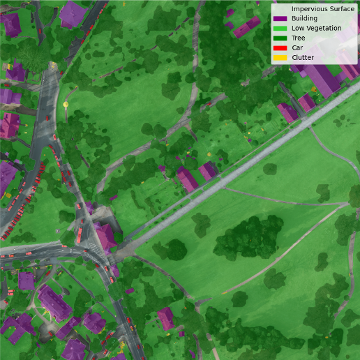
  </div>
</p>

<p align="center">
  <div style="display: inline-block;">
    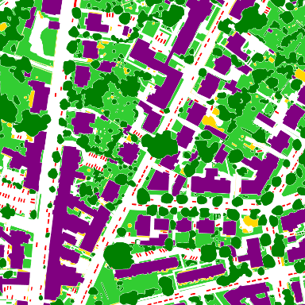
    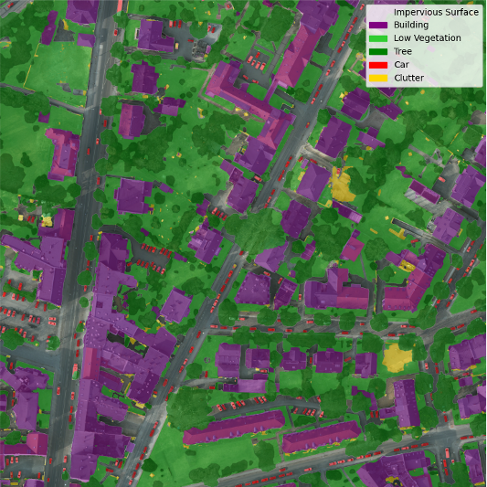
  </div>
</p>

### Potsdam Left Table and Vaihigen Right Table
<p align="center">
  <div style="display: inline-block;">
    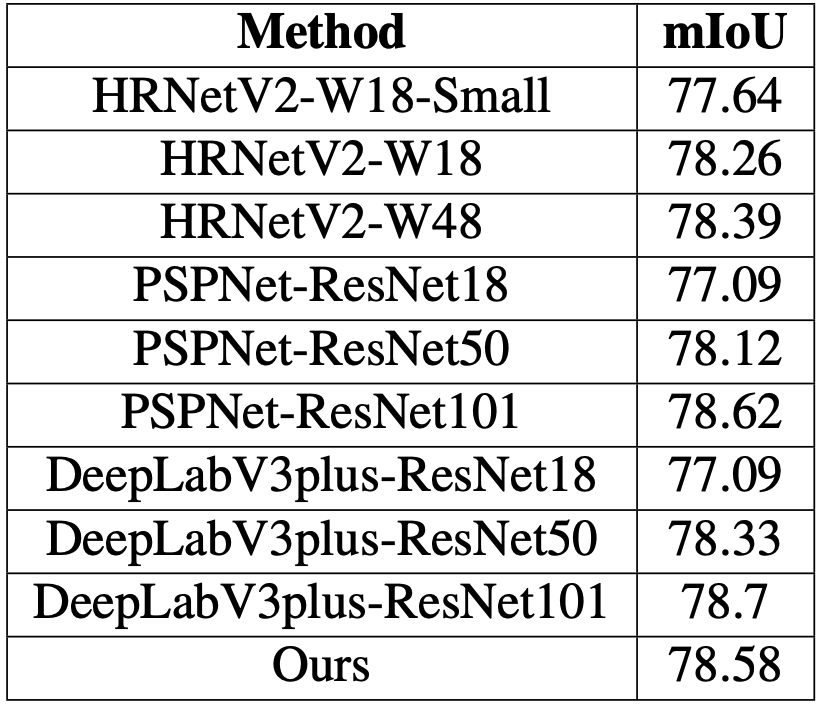
    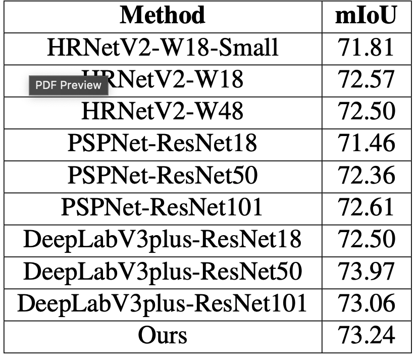
  </div>
</p>

## Citation
If you liked our paper, please consider citing it [will update TBD sections soon]
```bibtex
@inproceedings{perera2024mobileunetr,
  title={MobileUNETR: A Lightweight End-To-End Hybrid Vision Transformer For Efficient Medical Image Segmentation},
  author={Perera, Shehan, Erzurumlu, Yunus, Gulati, Deepak and Yilmaz, Alper},
  booktitle={Proceedings of the IEEE/CVF European Conference on Computer Vision (ECCV)},
  pages={TBD},
  year={2024}
}
```
```bibtex
@article{perera2024mobileunetr,
  title={MobileUNETR: A Lightweight End-To-End Hybrid Vision Transformer For Efficient Medical Image Segmentation},
  author={Perera, Shehan, Erzurumlu, Yunus, Gulati, Deepak and Yilmaz, Alper},
  journal={https://arxiv.org/abs/2409.03062},
  year={2024}
}
